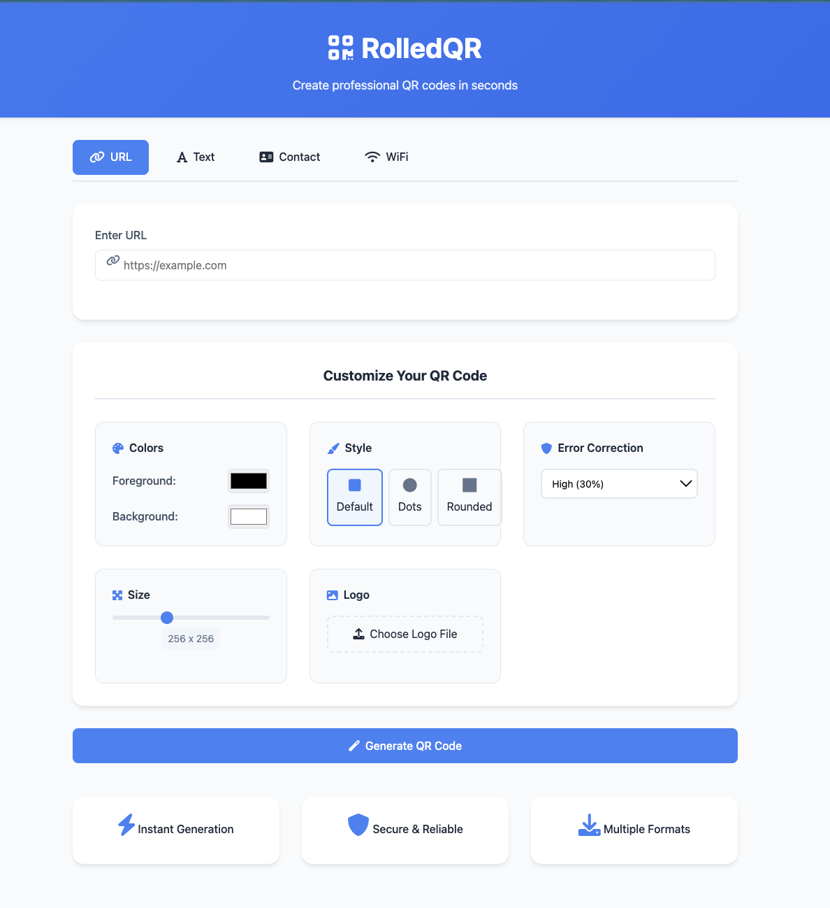
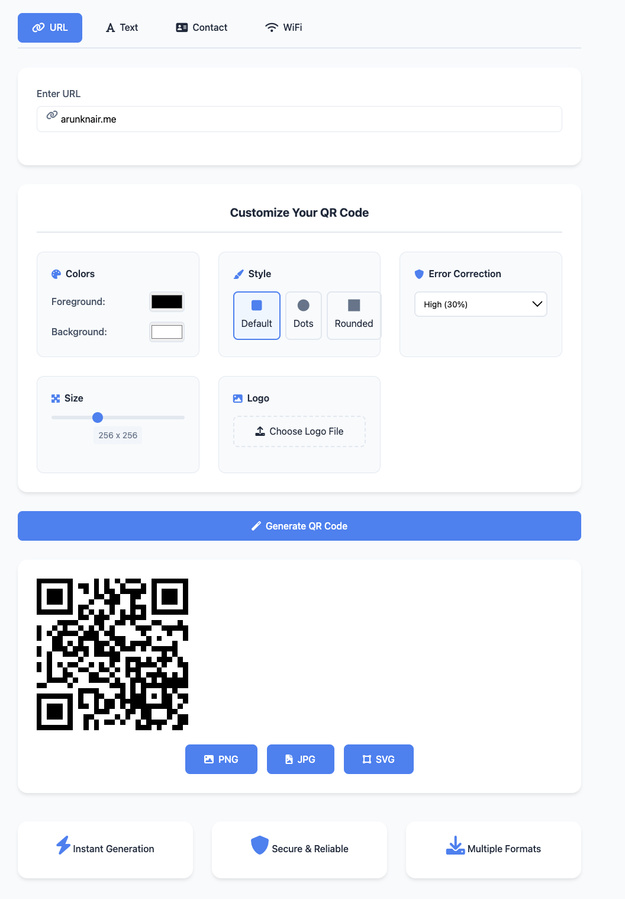
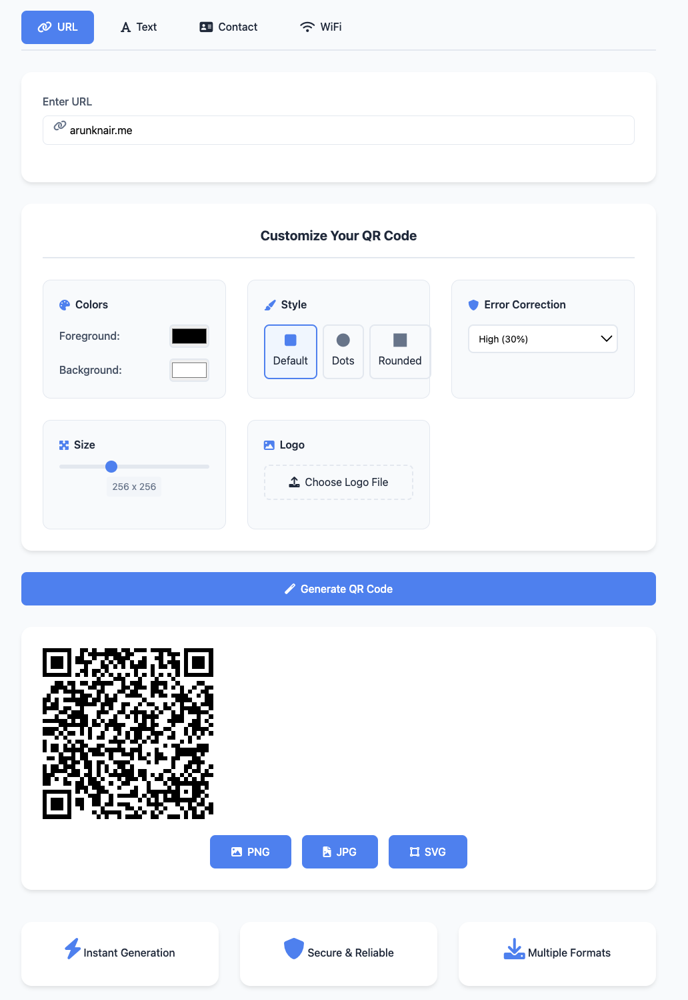
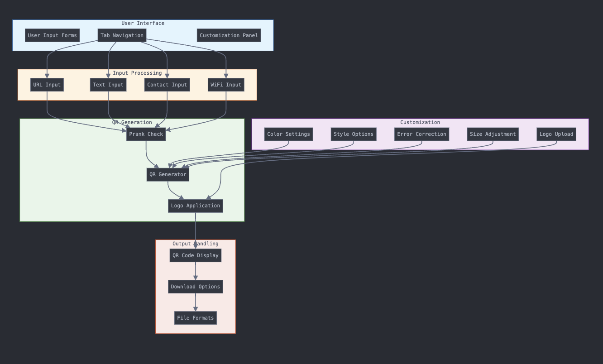

# RolledQR - Professional QR Generator 🎯

## Basic Details
### Team Name: QR-Coders

### Team Members
- Team Lead: AKN414-IND - Open Source Enthusiast

### Project Description
RolledQR is a web-based QR code generator that lets users create customizable QR codes in seconds. From URLs to WiFi connections, RolledQR supports various types and offers unique style and color customizations.

### The Problem (that doesn't exist)
Ever struggled to make a QR code... look fancy?

### The Solution (that nobody asked for)
RolledQR combines robust QR code functionality with fun styles, colors, and even a sprinkle of pranks! But generating a meme qr instead of the original one at random.

## Technical Details
### Technologies/Components Used
For Software:
- **Languages**: HTML, CSS, JavaScript
- **Frameworks**: None
- **Libraries**: `qrcodejs`, `html2canvas`, `FontAwesome`
- **Tools**: Cursor, GitHub

For Hardware:
- Browser-based, no hardware components required.

### Implementation
#### For Software:
### Installation
Clone the repository and navigate to the project directory:
```bash
git clone https://github.com/AKN414-IND/RolledQR.git
cd RolledQR
```

### Run
Open `index.html` in your preferred web browser to start the app.

### Project Documentation
#### For Software:

### Screenshots


*The main interface for customizing QR codes.*


*Various customization options for QR codes, including colors, styles, and logos.*


*Example of a prank QR code generated with RolledQR.*


### Diagrams

*Diagram showing how the RolledQR application processes QR customization inputs and generates the final QR. made with mermaid*

### Project Demo
#### Video

*Watch the demo to see RolledQR's functionalities in action!*


## Team Contributions
- **AKN414-IND**: Developed the full application, implemented QR customization features, and coded the random prank QR feature.

---
Made with ❤️ at TinkerHub Useless Projects 


